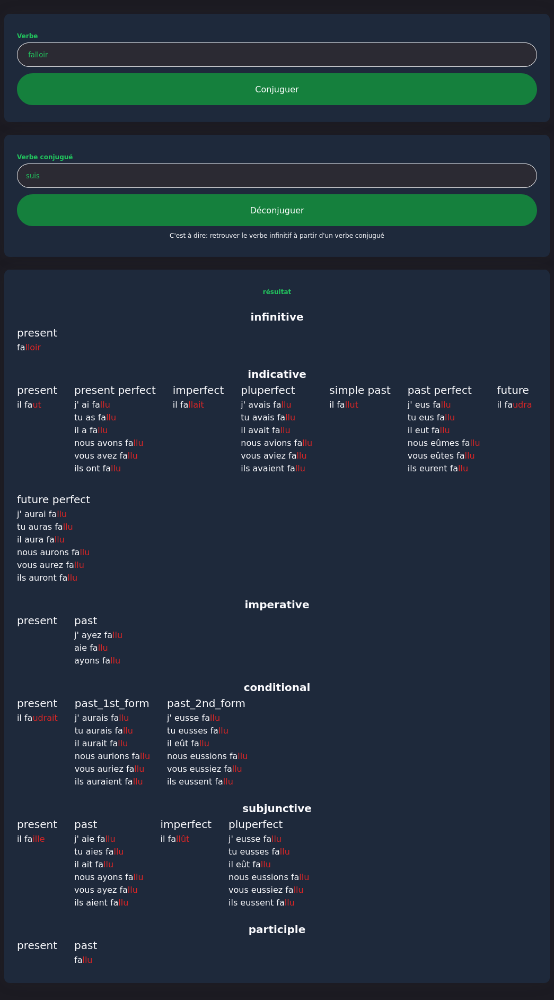
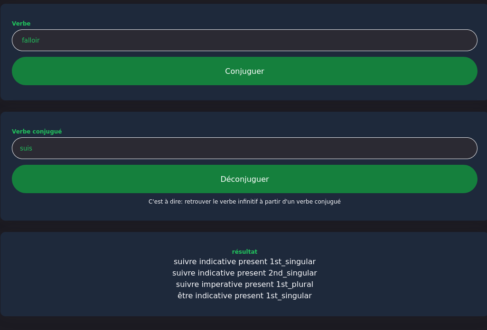

# Verbiste Cordova

An open-source android application to get the conjugation of French verbs
and to get back a verb from its conjugated form

Note: it's a rewrite from https://github.com/allan-simon/verbiste-android

in order to generate the database you need to run the python script

```
cd utils ; python xml2sqlite.py
```

# How to build 

TODO but basically

1. install android sdk
2. install cordova
3. run `cordova build`

# What does it look like




# Why rewriting it

1. I'm much more efficient in html/css/js than in android
2. I can easily test it in a browser
3. Less chance of having things getting deprecated
4. It was an excuse to learn Cordova

# License

The database is licensed under GPLv2 as required by verbiste project

the code is licensed under MIT license c
